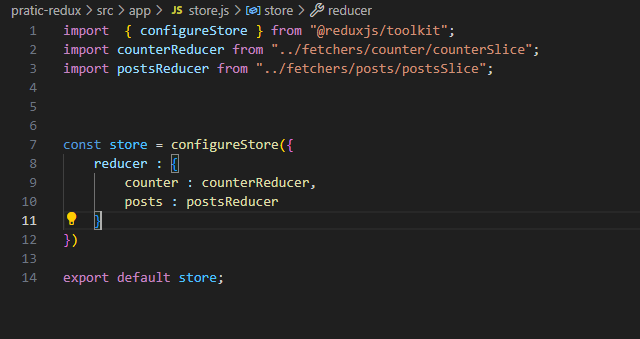
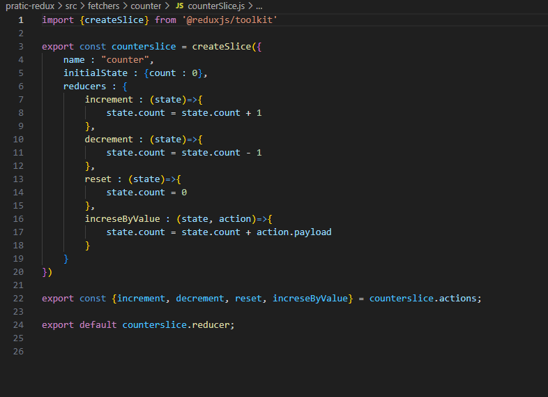
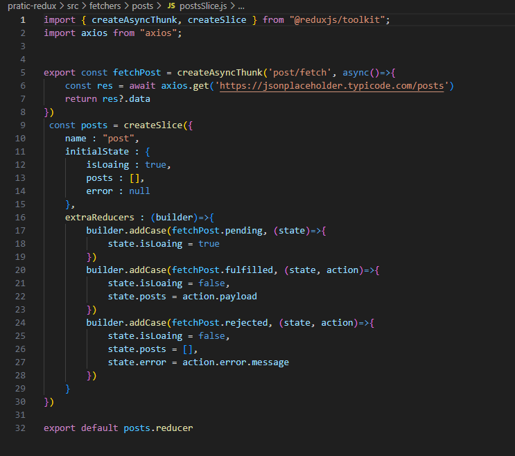
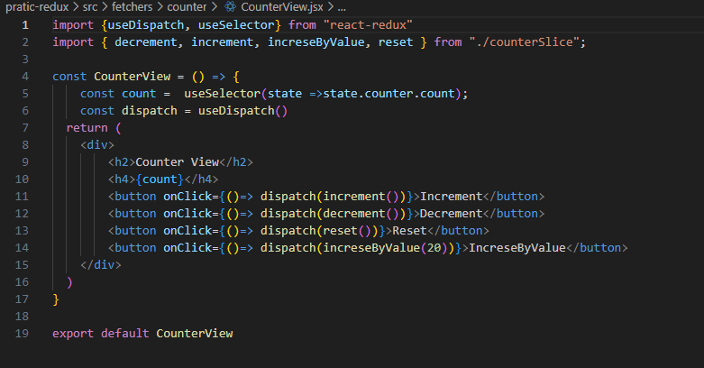

# React-Redux Overview

React-Redux is the official binding library for using React with Redux. It allows React components to read data from a Redux store and dispatch actions to update the store.

## Architecture Diagram

Here's an image representing the architecture of React-Redux:
## React Redux Toolkit Core Concept

### React Redux Store
This Store Use Global and add all slice in this code follow image

### Slice Only
This Is Only For use global variable not data fetch if need to control data and any function use this follow image

### Redux Data Fetch
this method use for data fetch and control data loading and erro follow image

### Dispatch function 
this dispatch only use for data showing when you work this global and this dispatch use store calling slice calling follow image

### Key Features

- **Provider**: Makes the Redux store available to your React components.
- **Connect**: Helps map state and dispatch to your component’s props.
- **Hooks**: `useSelector` and `useDispatch` hooks allow using Redux state and actions in functional components.
